# DOIT

## Milestone Project 5 - front-end with drf and react
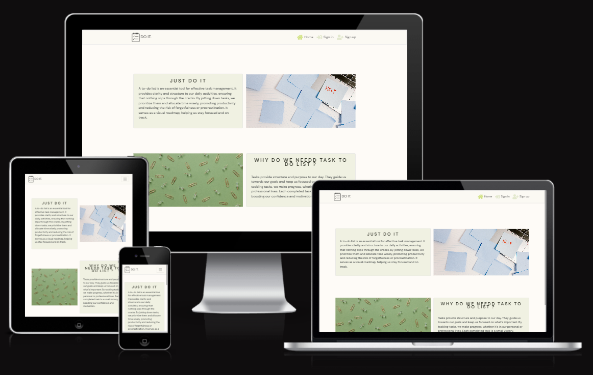

*  DoIt provides structure and purpose to our day. They guide us towards our goals and keep us focused on what's important. By tackling tasks, we make progress, whether it's in our personal or professional lives. Each completed task is a small victory, boosting our confidence and motivation.
  
* This is my Milestone Project 5 submission for Code Institute's Diploma in Web Application Development course. DOIT is built using Django restframework and react. Technologies used include HTML, CSS, Javascript, Python,react,reactBootstrap.
  
## Live Project for front end

[View the live project here.](https://taskstodo-5c8dcdc02268.herokuapp.com/)

## Repository for react

[Find the project repository here.](https://github.com/Mahsak89/justdoit)

# Table of Contents

## Contents

- [DoIt](#DoIt)
  - [Milestone Project 5 - FRONT-END Development](#milestone-project-5---FRONT-END-development)
  - [Live Project](#live-project)
  - [Repository](#repository)
- [Table of Contents](#table-of-contents)
  - [Contents](#contents)
- [User Experience](#user-experience)
  - [User stories](#user-stories)
  - [Design](#design)
   
- [Features](#features)
  
- [Future Features](#future-features)
  

 
- [Technologies Used](#technologies-used)
  - [Languages Used](#languages-used)
  - [Frameworks \& Libraries](#frameworks--libraries)
  - [Frameworks \& Libraries](#frameworks--libraries-1)
  - [Storage \& Hosting](#storage--hosting)
  - [IDE \& Version Control](#ide--version-control)
  - [Other Tools](#other-tools)
  - [Testing \& Code Validation](#testing--code-validation)
- [Testing](#testing)
- [Deployment](#deployment)
- [Credits](#credits)
  - [Code](#code)
  - [Content](#content)
  - [Media](#media)
  - [Acknowledgements](#acknowledgements)

# User Experience

## User stories

| User Story ID | As a/an | I want to be able to... | So that I can... |
| --- | ----------- | ----------- | ----------- |
 | Authentication and Navigation |
| 1 |  user | view a navbar from every page |  I can navigate easily between pages |
 | 2 | User | navigate through pages quickly  | I can view content seamlessly without page refresh |
 | 3 | User  | create a new account  | I can access all the features for signed up users |
 | 4 |  User  | sign in to the app |  I can access functionality for logged in users |
 | 5 |  User | tell if I am logged in or not | I can log in if I need to |
 | 6 | User |  maintain my logged-in status until I choose to log out | my user experience is not compromised |
 | 7 |  As a logged out user |  see sign in and sign up options  | I can sign in/sign up |
 | 8 |  user  |   view user's avatars | I can have a better user experience |
 | Task page |
| 9 |  logged in user |  create tasks |   I can organize my days better |
 | 10 | logged in user | view the details of a single task  | I can learn more about it|
 | 11 |  logged in user  | change the state of my task  | I know which tasks are completed |
 | 12 | logged in user  |  keep scrolling through my tasks that are loaded for me automatically |  I don't have to click on "next page" etc |
 | 13 | an owner of a task | delete my task  |  I can control removal of my task from the application |
 |14 |as task owner |  edit my tasks | I can make corrections or update my task after it was created |
  | Data filtering |
 |15 |  logged in user |  view all tasks, ordered by most recently created first   | I know about all the task |
 | 16 |  logged in user  |    view the tasks I completed  |  I can keep track of my progress |
 | 17 |  logged in user  |    view the tasks filterd by priority |  I can keep track ofwhat is my priority |
  | categories|
 |18 |  logged in user |  create a new category   | I can catefgorised my task better |
 | 19 |  logged in user  |    view the my list of categories  |  I know what categories I have madea |
 | 20 |  logged in user  |    edit my categories | I can make corrections or update my categories after it was created |
 | 21 |  logged in user  |    delete my category |   I can control removal of my category  from the application |
 | profile|
 |22 |  logged in user |  edit my profile   | I can make corrections or update my profile after it was created  |
 | 23 |  logged in user  |   edit my username |  I can make corrections or update my username after it was created |
 | 24|  logged in user  |    edit my password | I can make corrections or update my password after it was created |
 

 

 

 
## Design

### Colour Scheme

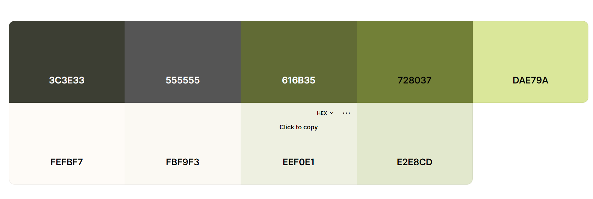

### Typography

 I used DM Sans
Designed by Colophon Foundry, Jonny Pinhorn, Indian Type Foundry

# Features

## All Pages

- Responsive design
- Semantic HTML
- Custom CSS to give the website a cohesive and user-friendly appearance

### Components
- Avatar

 the Avatar component simplifies the process of displaying user avatars in a React application, offering flexibility in terms of image source, size, and additional accompanying text.

- MoreDropdown

This component can be used in a parent component, and you can provide handleEdit and handleDelete functions as props to define the behavior when the corresponding actions are triggered in the dropdown.

- Navbar

This component creates a responsive navigation bar with conditional rendering based on the user's authentication status. The dropdown menu appears when the user clicks on the toggle button, and it closes when clicking outside the dropdown. The design incorporates Font Awesome icons and custom styling for a polished user interface.
 
- sidebar

The SideBar component serves as a navigation sidebar, providing links to different pages and dynamically rendering categories based on the current user.

### hooks
- UseClickOutsideToggle

This hook is useful for scenarios where you want to toggle a state, such as a dropdown menu or modal, based on clicks outside a particular DOM element. Components using this hook can manage the expanded state and use the ref to specify which DOM element's clicks should trigger the toggle behavior.

- UseRedirect
This hook is designed for scenarios where you want to handle redirection based on the user's authentication status. It can be used in components or routes to manage the navigation flow. The redirection logic is based on whether the user is logged in or logged out, and the hook makes use of Axios for token refreshing.

### Contexts
- CurrentUserContext

This context provider and associated contexts enable the management of the current user's state and provide hooks for accessing and updating this information in various components within the application. The axios interceptors handle token refreshing for secured routes.
### api

- axiosDefaults

These configurations offer flexibility and customization for making HTTP requests in your application. Adjust the base URL, content type, and credentials settings as needed for your specific use cases.

### utils

These functions seem to be part of a larger system that deals with authentication using JWTs and handling paginated data fetching. The fetchMoreData function is particularly useful in scenarios where additional data needs to be loaded as the user scrolls or interacts with a paginated interface

### data filtering
- completed
- tasks owner
- tasks priority
- tasks categories

### pages 

- signup /in

The SignIn/upForm component combines form elements, error handling, and authentication logic to create a user-friendly sign-in page. 

- CategoriesList

the CategorieList component renders a list of categories, provides infinite scrolling for additional data, and includes options for editing and deleting categories. The component uses various hooks and utility functions to manage state and handle navigation.

- edit/createCategoryForm

These components provides a user-friendly form for creating and editing a category, with conditional rendering based on the user's authentication status. If the user is logged in, the category creation form is displayed; otherwise, a message prompts the user to sign in. The form handles category creation and displays error messages if any.

- homepage 

shown as the first page

- not found page

when the page urls doesnt exist

- pofiledetail

 this component combines the display of a user's profile details with forms for editing the profile, username, and password. The visibility of each form is controlled by state flags, and the component fetches the user's profile data based on the provided id parameter.

- profile edit form

this component provides a form for users to edit their profile details, including a bio and an optional profile image. The form includes conditional rendering based on screen size for better responsiveness.

- UsernameForm

the UsernameForm component allows users to change their username, displaying any validation errors and providing buttons to save or cancel the changes.

- UserPasswordForm

The UserPasswordForm component allows users to change their password, displaying any validation errors and providing buttons to save or cancel the changes. 

- CreateTaskForm

The CreateTaskForm component allows users to create a new task by filling in various details such as title, description, start date, deadline, priority, and category.

- EditTaskForm

The EditTaskForm component allows users to edit an existing task by modifying its details such as title, description, start date, deadline, priority, and category.

- Task

The Task component encapsulates the UI and functionality related to displaying and interacting with a single task in the application.

- TaskPage

the TaskPage component fetches and displays the details of a single task based on the task ID from the URL parameters.

- TasksPage

the TasksPage component provides a structured layout for displaying tasks with a sidebar. The task list supports infinite scrolling, and the tasks are fetched from the server based on the provided filter.

# Future Features

- have  more data filtering
- buid a habit tracker

# Technologies Used

## Languages Used

- [HTML5](https://en.wikipedia.org/wiki/HTML5)

- [CSS3](https://en.wikipedia.org/wiki/CSS)

- [JavaScript](https://en.wikipedia.org/wiki/JavaScript)
- [react](https://en.wikipedia.org/wiki/react)
[reactBootstrap](https://en.wikipedia.org/wiki/reactbootstrap)

- [Python](https://en.wikipedia.org/wiki/Python_(programming_language))
## Frameworks & Libraries

### [Django](https://www.djangoproject.com/)
  - This website is built using Django, a high-level Python web framework. Lonely House features multiple apps with model, view and template layers. I have also used Django to provide an admin view, create forms and test my website. Further features used include [Django Allauth](https://django-allauth.readthedocs.io/en/latest/index.html) for user authentification, Pillow for uploading images, and Crispy Forms.

### [React](https://reactjs.org/)

- React is a JavaScript library for building user interfaces.

### [React Bootstrap](https://react-bootstrap.github.io/)

- React Bootstrap is a popular Bootstrap framework rebuilt for React, providing responsive UI components.
 I used bootstrap throughout the site to make it responsive. The website uses Bootstrap's Containers, Grid System, Flexbox and Spacing utilities. I sourced code from the Bootstrap documentation when building the Navbar, Image Carousels, Cards and Buttons.

### [React Router](https://reactrouter.com/)

- React Router is a standard library for routing in React applications.

### [useState and useEffect Hooks](https://reactjs.org/docs/hooks-state.html) 

- `useState` and `useEffect` are React hooks used for managing state and side effects in functional components.

### [Axios](https://axios-http.com/)

- Axios is a promise-based HTTP client for the browser and Node.js, making it easy to send asynchronous HTTP requests.

  

### [Google Fonts](https://fonts.google.com/)
  - Fonts are imported from google fonts.

## Storage & Hosting

- [Heroku](https://id.heroku.com/login)
  - Heroku is the deployment source I used for this project.

- [Github](https://github.com/)
  - Github was used to create and store the project repository.

## IDE & Version Control

- [Git](https://git-scm.com/)
  - Git was used as a version control in the terminal.

* [codeanywhere](https://app.codeanywhere.com/)
  * codeanywhere was used to create my files and where I wrote the code.

## Other Tools

- ES7 snippet for more convinient
- prettier formater for more convinient
-  [coolors](https://coolors.co/) for more color pallete

- [Google Chrome Dev Tools](https://developer.chrome.com/docs/devtools/)
  - Google Chrome's Dev Tools were used while building the project to test responsiveness and for debugging.
- [pexels](https://www.pexels.com/)
  - Unsplash was used to source the website imagery.

- [ChatGPT](https://openai.com/blog/chatgpt/)
  - OpenAI's ChatGPT was used in part to generate servicess for business consulting.

## Testing & Code Validation

The following tools were used for testing and code validation. You can see results in the Testing section of this README.

- [W3C Markup Validation Service](https://validator.w3.org/)
- [W3C CSS Validation Service](https://jigsaw.w3.org/css-validator/)

# Testing

- I have tested my app manually to check each page and function works also there was no problem according to  ESLint
and iv got console.log()to check the amount of my varaibles and checked their correctness

 - fixed the errror of the app accepting wrong input as deadline it will no longer accept but it wont show the warning.

 - fixed the errror of not filtering and showing tasks by categories

 - fixed some wrong spellig and vocabs.
 
 - fixed  my categories list created by the user in sidebar

- homepage 
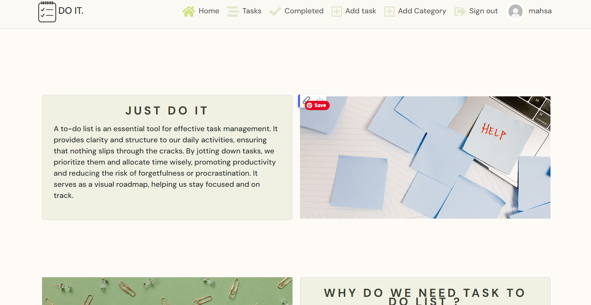

- signup/in work ok

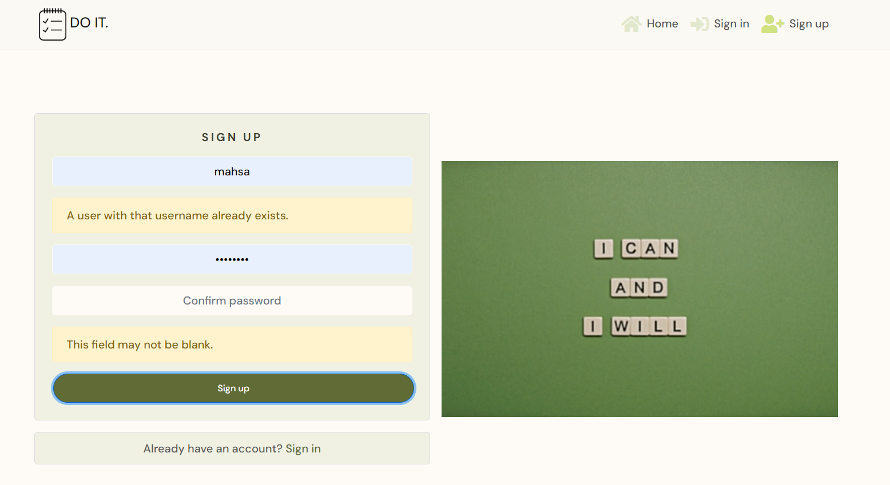

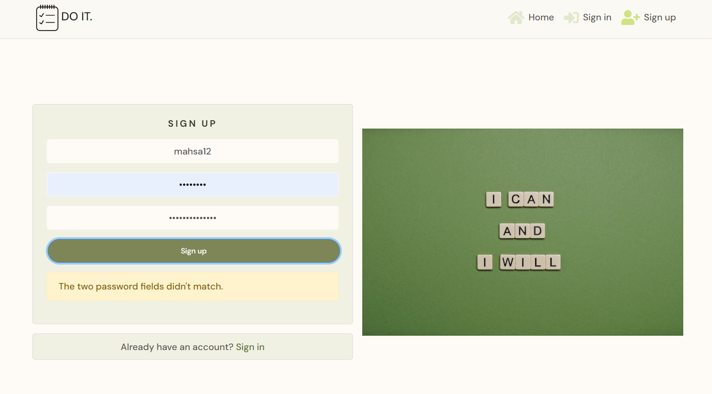

- priority

fixed the previous error that i couldnt create low priorities task 

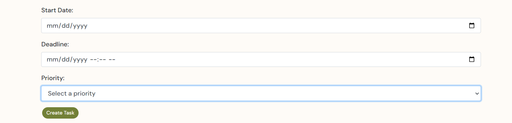

not found task by empty priority

 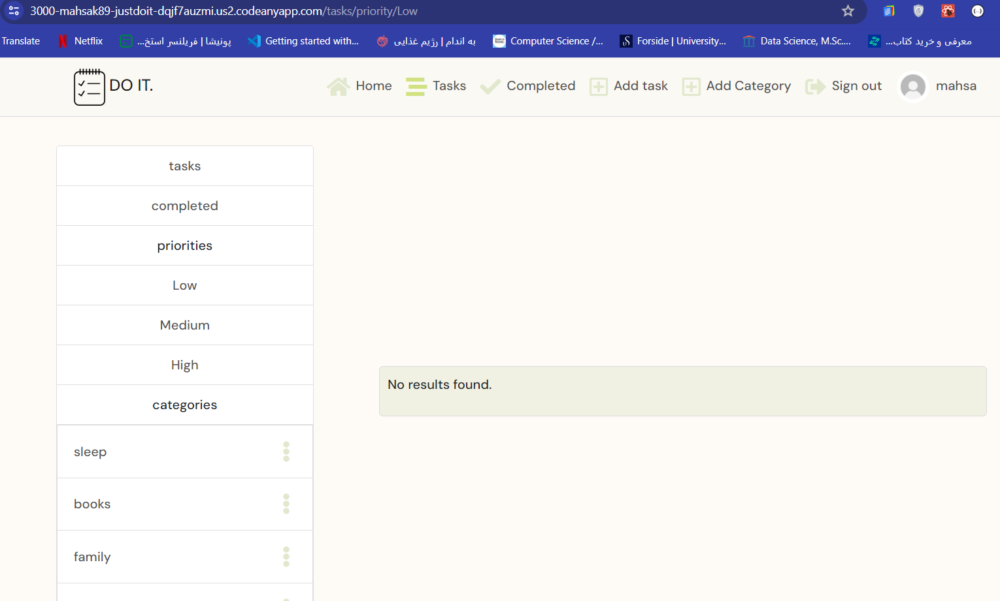    

 filter by priority

 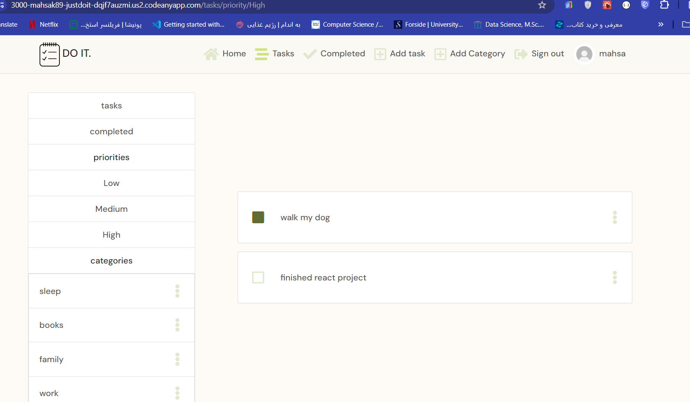  

 - categories

 sidebar categories list

 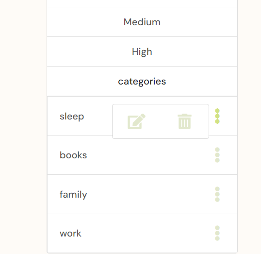  

 create category

 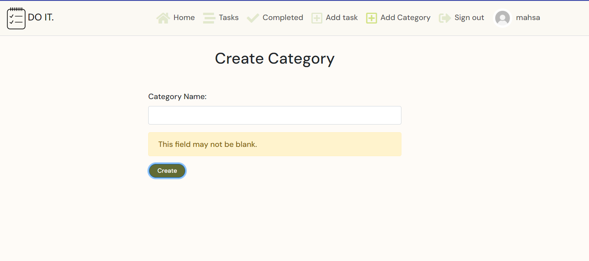  

 edit category
 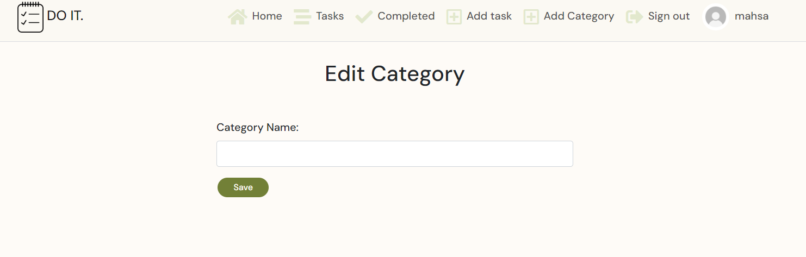  

 fixed the error of showing my task by categories filter 

 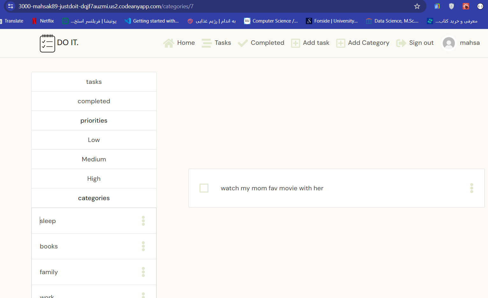  

 - tasks
 shows all tasks
  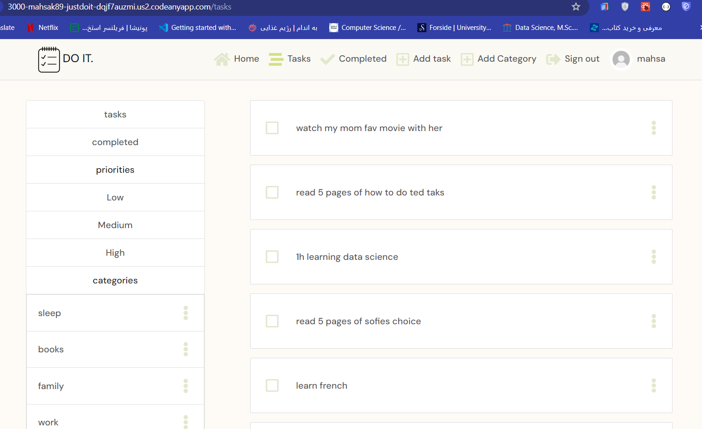 

 edit Task

   
 create a new task
 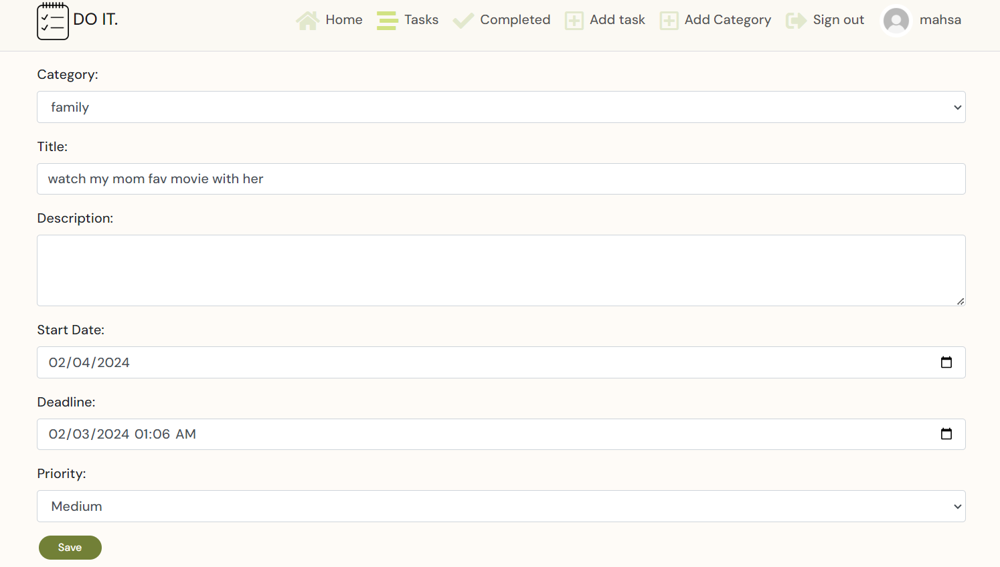  

 - completed
  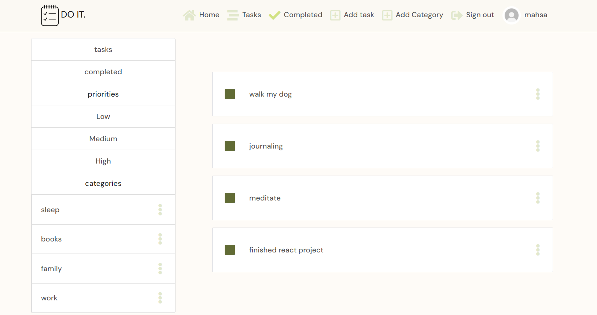  

  - profiles

  shoe the error msg of unmatched password 

  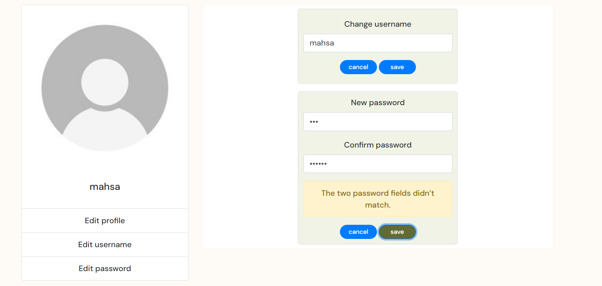  

  

# Deploymen

* Remove all the console.logs from the application
 : Add the Heroku deployment commands in terminal

* In package.json file, in the “scripts” section, add the following prebuild command:
"heroku-prebuild": "npm install -g serve",
This will install a package needed to serve our single page application on heroku
* Add a Procfile at the root of the project with the following web command:
web: serve -s build
*  In your workspace, ensure you have committed and pushed all of your code to github.

* Log in to heroku.com and open the dashboard for your react application (remember this is separate from the DRF application that runs your API)
* Select the “Deploy” tab in the dashboard
* Scroll down to the bottom and then select “Deploy Branch”
* Wait for your build to complete (you can click “view build log” to watch the process in a larger window)
* When you see the message “deployed to Heroku” in the build log, click the “open app” button at the top of the page.

# Credits

## Code

### Code Institute:
  - I sourced the framework for this project from the Code Institute Boutique Ado walkthrough. I have customised my website wherever possible. My checkout, Stripe payments, webhooks and email verification are very similar to the walkthrough as I desired to focus more on making my website fit for my users goals, rather than adding any further checkout or payment functionality.

### Django:
  - I referred to the Django documentation whilst building my project. I found articles on [testing](https://docs.djangoproject.com/en/4.1/topics/testing/) and [making database queries](https://docs.djangoproject.com/en/4.1/topics/db/queries/) particularly useful.
### DRF 

### react Bootstrap:
  - I have used Bootstrap classes throughout my project, including for layout utilities and cards. I sourced code from the Bootstrap documentation when building the navbar, image carousels, and dropdowns. These were sourced through the [ react Bootstrap documentation](https://react-bootstrap-v4.netlify.app/components/)

### Stack Overflow: 
  

## Media
- I used Pexels for all my images
## Acknowledgements
- Thank you to the Code Institute  Community for their encouragement and technical support.

- Thank you to the tutors and staff at Code Institute for their support.
- I used help to write my readme file from moments in code institute

Please note this is a personal project. This website is purely for the sake of the developer's portfolio and not for public consumption.
Mahsa Khoshnoud, 2023.